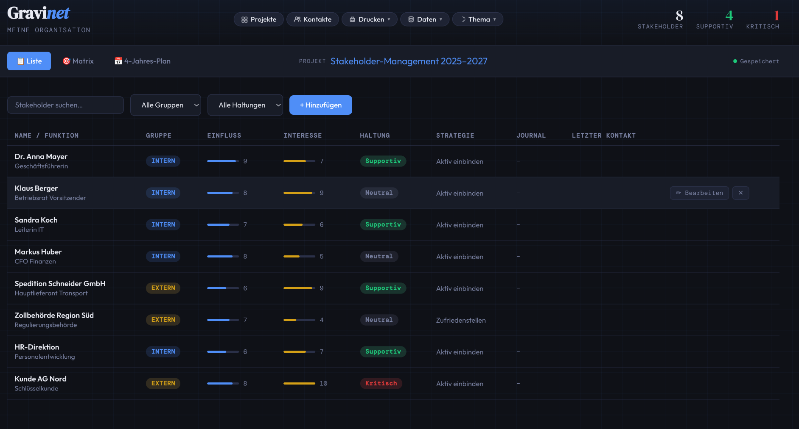
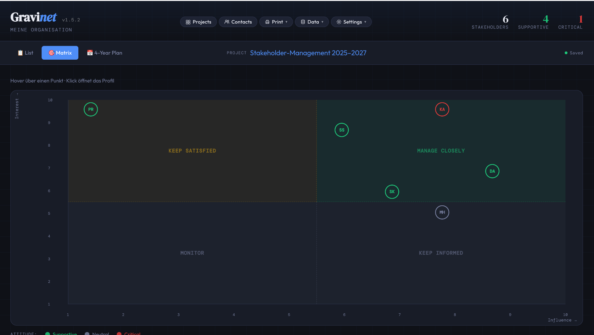
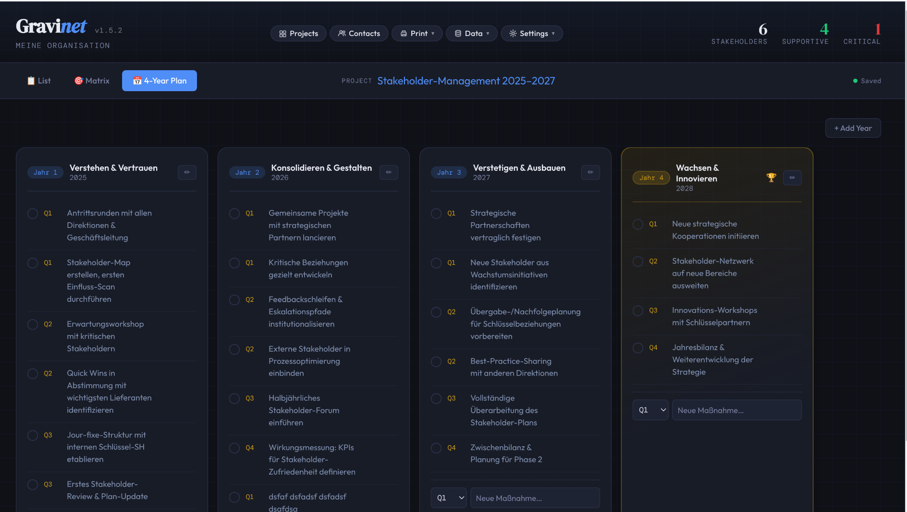
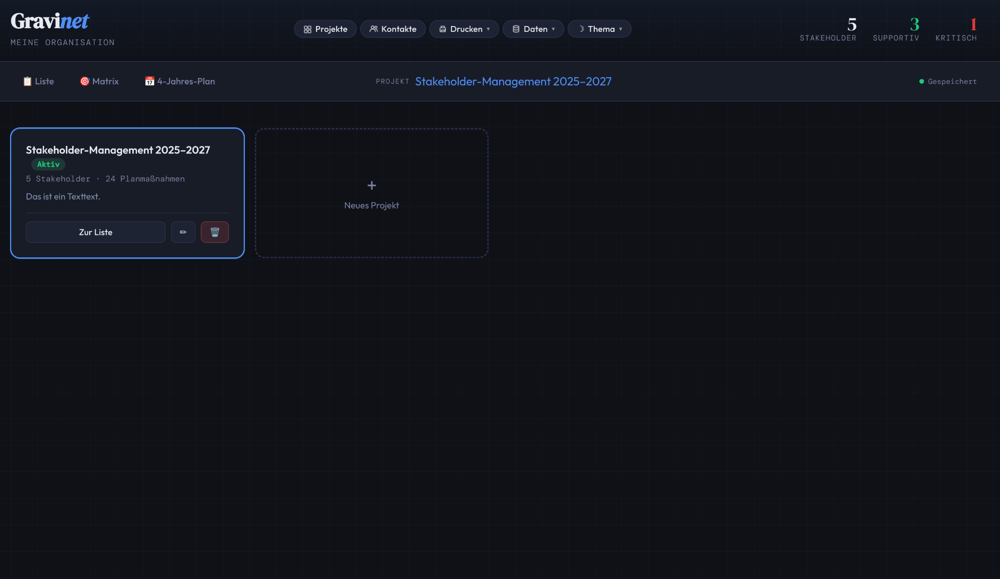

# Gravinet

**Stakeholder-Management für GNOME Linux** — als Electron AppImage, vollständig offline, ohne Server oder Cloud.

Gravinet hilft dabei, Stakeholder zu erfassen, nach Einfluss und Interesse zu kartieren, Beziehungen über ein Journal zu dokumentieren und einen mehrjährigen Maßnahmenplan zu führen.

---

## Features

- **Projekte** — mehrere Stakeholder-Projekte mit eigener Konfiguration, Plan und Beschreibung
- **Kontakte** — zentrale Stakeholder-Datenbank, projektübergreifend geteilt
- **Liste** — Stakeholder-Tabelle mit Suche, Filter, Geburtstags-Hinweisen und Letzter-Kontakt-Anzeige
- **Matrix** — interaktive Einfluss-/Interesse-Matrix mit Quadranten-Overlay und Tooltips
- **N-Jahres-Plan** — flexibler Mehrjahresplan pro Projekt, Maßnahmen je Quartal, abhakbar
- **Journal** — persönliche Kontaktnotizen pro Stakeholder mit Zeitstempel
- **PDF-Export** — Kontaktdatenblätter und Projektbericht (Tabelle + Matrix + Plan) als PDF in Downloads
- **Daten-Backup** — Export/Import als JSON-Datei
- **Hell/Dunkel-Thema** — wird gespeichert und beim nächsten Start wiederhergestellt
- **Vollständig offline** — alle Daten im lokalen `localStorage`, kein Account, kein Server

---

## Screenshots

| Liste | Matrix |
|-------|--------|
|  |  |

| N-Jahres-Plan | Projekte |
|---------------|---------|
|  |  |

---

## Installation

### AppImage (empfohlen)

1. [Release herunterladen](../../releases/latest) → `Gravinet-1.0.0.AppImage`
2. Ausführbar machen und starten:

```bash
chmod +x Gravinet-1.0.0.AppImage
./Gravinet-1.0.0.AppImage
```

Optional: In GNOME als Desktop-App integrieren (Nautilus → Eigenschaften → Als Programm ausführen).

---

## Selbst bauen

**Voraussetzungen:** Node.js ≥ 18, npm

```bash
git clone https://github.com/famrau/gravinet.git
cd gravinet
npm install
npm start          # Entwicklungsmodus
npm run build      # AppImage bauen → dist/Gravinet-1.0.0.AppImage
```

### Windows (.exe / NSIS-Installer)

Das Windows-Build muss auf einem **Windows-Rechner** oder in einer Windows-VM durchgeführt werden. Cross-Compilation von Linux nach Windows wird von electron-builder nicht zuverlässig unterstützt.

1. Repository auf einem Windows-Rechner klonen
2. Node.js ≥ 18 installieren
3. In `package.json` den `build`-Block um einen Windows-Target erweitern:

```json
"win": {
  "target": [{ "target": "nsis", "arch": ["x64"] }],
  "icon": "app/icons/icon-512.png"
}
```

4. Build ausführen:

```bash
npm install
npx electron-builder --win
```

Ergebnis: `dist/Gravinet Setup 1.0.0.exe` (NSIS-Installer)

Alternativ kann ein portables EXE ohne Installer gebaut werden:

```json
"target": [{ "target": "portable", "arch": ["x64"] }]
```

---

### macOS (.dmg)

Das macOS-Build muss auf einem **Mac** durchgeführt werden — Apple erlaubt keine Cross-Compilation für macOS auf anderen Plattformen.

1. Repository auf einem Mac klonen
2. Node.js ≥ 18 installieren (z.B. via [Homebrew](https://brew.sh): `brew install node`)
3. In `package.json` den `build`-Block um einen macOS-Target erweitern:

```json
"mac": {
  "target": [{ "target": "dmg", "arch": ["x64", "arm64"] }],
  "icon": "app/icons/icon-512.png",
  "category": "public.app-category.productivity"
}
```

4. Build ausführen:

```bash
npm install
npx electron-builder --mac
```

Ergebnis: `dist/Gravinet-1.0.0.dmg` (für Intel und Apple Silicon)

> **Hinweis:** Für eine signierte und notarisierte macOS-App ist ein kostenpflichtiges Apple Developer-Konto erforderlich. Ohne Signierung erscheint beim ersten Start eine Sicherheitswarnung, die über Systemeinstellungen → Datenschutz & Sicherheit → „Trotzdem öffnen" umgangen werden kann.

---

## Projektstruktur

```
gravinet/
├── main.js          # Electron-Hauptprozess (Fenster, PDF-Druck, Theme)
├── preload.js       # Context Bridge: PDF-Druck und Theme-API
├── package.json     # Build-Konfiguration
└── app/
    ├── index.html   # Gesamte App (HTML + CSS + JS, single file)
    └── icons/       # App-Icons (SVG + PNG in 16–512px)
```

---

## Datenspeicherung

Alle Daten werden im `localStorage` des Electron-Fensters gespeichert unter dem Schlüssel `gravinet_v1`. Der Speicherort auf dem Dateisystem:

```
~/.config/Gravinet/Local Storage/
```

**Backup:** Daten → Exportieren speichert eine JSON-Datei. Diese kann auf einem anderen Rechner über Daten → Importieren wiederhergestellt werden.

---

## Tastenkürzel

| Aktion | Kürzel |
|--------|--------|
| Neue Maßnahme im Plan speichern | `Enter` im Textfeld |
| Organisations-Bezeichnung bearbeiten | Hover über Untertitel → ✏ |
| Organisations-Bezeichnung speichern | `Enter` oder ✓ |
| Organisations-Bezeichnung abbrechen | `Escape` |

---

## PDF-Druck

**Kontaktdatenblätter** (Drucken → Kontaktdatenblätter):
- Kontakte auswählen, PDF wird in `~/Downloads` gespeichert
- Pro Kontakt eine Seite: Stammdaten, alle Projektzuordnungen, Journal

**Projektbericht** (Drucken → Projektbericht):
- Seite 1: Stakeholder-Tabelle
- Seite 2: Stakeholder-Matrix
- Seite 3: N-Jahres-Plan
- Dateiname: `Projektname-DATUM.pdf`

---

## Tech-Stack

| Technologie | Verwendung |
|-------------|-----------|
| [Electron 28](https://www.electronjs.org/) | Desktop-Shell, PDF-Druck |
| [electron-builder](https://www.electron.build/) | AppImage-Paketierung |
| Vanilla HTML/CSS/JS | Gesamte UI, kein Framework |
| [Outfit](https://fonts.google.com/specimen/Outfit) | UI-Schrift |
| [DM Serif Display](https://fonts.google.com/specimen/DM+Serif+Display) | Überschriften |
| [DM Mono](https://fonts.google.com/specimen/DM+Mono) | Monospace/Labels |

---


