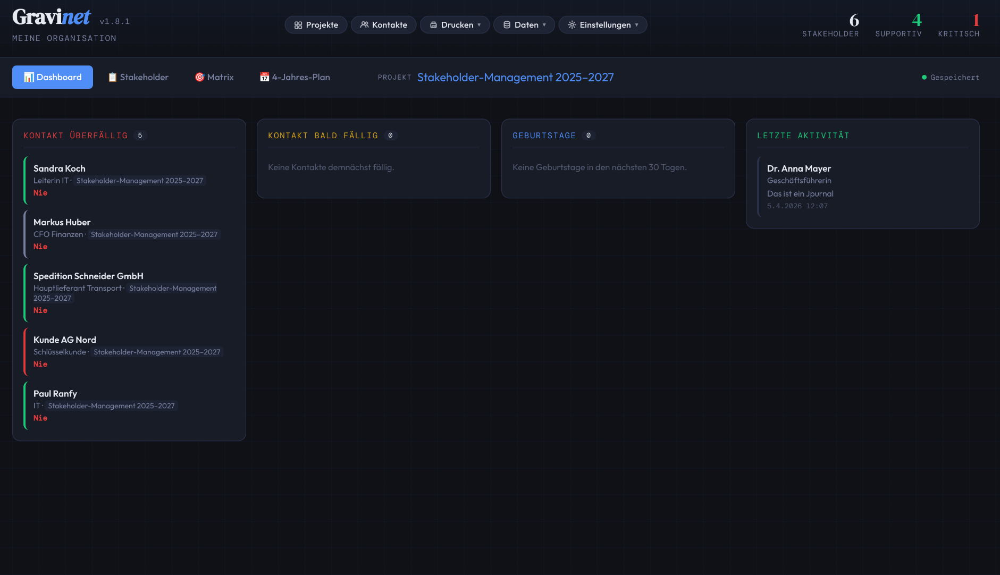
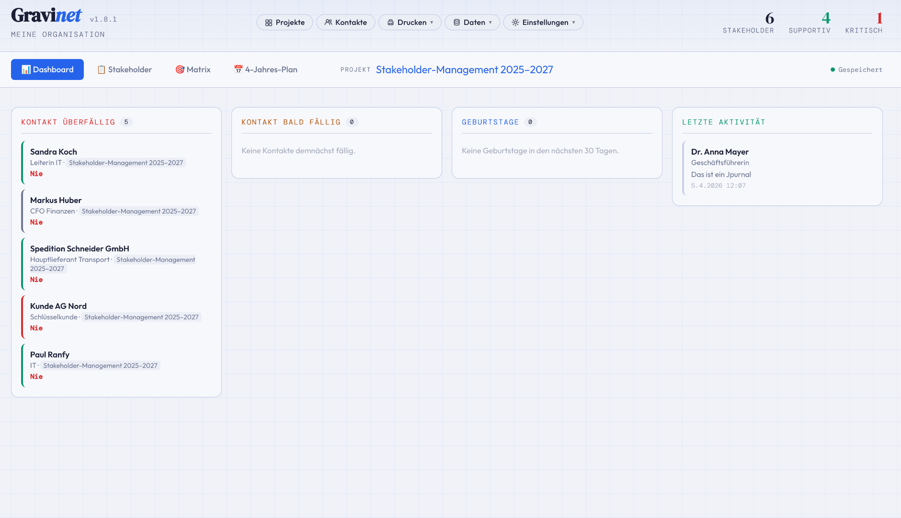

# Gravinet

**Stakeholder Management for Linux** — as an Electron AppImage, fully offline, no server or cloud required.

Gravinet helps you capture stakeholders, map them by influence and interest, document relationships through a journal, manage tasks per stakeholder, and maintain a multi-year action plan.

> 🇩🇪 Die App ist vollständig auf Deutsch und Englisch verfügbar — umschaltbar über Einstellungen → Sprache.
> 🇬🇧 The app is fully available in German and English — switchable via Settings → Language.

---

## Features

- **Projects** — multiple stakeholder projects, each with its own configuration, plan and description
- **Contacts** — central stakeholder database, shared across projects; per-stakeholder contact interval (including "None")
- **List** — stakeholder table with search, filters, birthday reminders and last-contact display
- **Matrix** — interactive influence/interest matrix with quadrant overlay and tooltips
- **Journal** — split-panel view: entry list left, full detail right; new entries via popup modal; inline delete; full-text search with type filter
- **Tasks** — split-panel view: task list left, detail right; new entries via popup modal; inline delete buttons; sort by date / title / name; auto-generated contact and birthday tasks; done-task toggle
- **Todoist Sync** — bidirectional sync with Todoist (API v1); sync modes: on start / every 30 min / every hour; secure token storage via Electron `safeStorage`; project selection and import target; deleted tasks are also removed from Todoist; nav sync status indicator (grey / yellow / green / red)
- **Dashboard** — four columns: overdue tasks, tasks due soon, all open tasks, recent journal activity; full-text stakeholder search
- **N-Year Plan** — flexible multi-year plan per project, measures per quarter, checkable
- **Desktop Notifications** — task reminders and overdue tasks; triggered on startup and every 4 hours
- **PDF Export** — contact sheets and project report (table + matrix + plan) as PDF to Downloads
- **CSV Import/Export** — stakeholder data as semicolon-separated CSV
- **Data Backup** — export/import as JSON file
- **Light/Dark Theme** — saved and restored on next launch
- **Language** — German and English, persisted per workspace
- **Fully offline** — all data stored in local files, no account, no server

---

## Screenshots

| Dark | Light | 
| -----| ------| 
|  |  |
| -----| ------| 
|  |  |
|------|--------|
|  |  |
|------|--------|
|  |  |
|------|--------|
|  |  |
|------|--------|
|  |  |


---

## Installation

### AppImage (recommended)

1. [Download the latest release](../../releases/latest) → `Gravinet-2.4.0.AppImage`
2. Make it executable and run it:

```bash
chmod +x Gravinet-2.4.0.AppImage
./Gravinet-2.4.0.AppImage
```

Optional: Integrate into GNOME as a desktop app (Nautilus → Properties → Allow executing as program).

---

## Build from Source

**Requirements:** Node.js ≥ 18, npm

```bash
git clone https://github.com/famrau/gravinet.git
cd gravinet
npm install
npm start          # Development mode
npm run build      # Build AppImage (Linux)
npm run build-win  # Build .exe installer (Windows, requires Wine on Linux)
npm run build-mac  # Build .dmg (macOS only)
```

### Windows (.exe / NSIS installer)

The Windows build must be performed on a **Windows machine** (or with Wine on Linux).

```bash
npm install
npm run build-win
```

Result: `dist/Gravinet Setup 2.4.0.exe` (NSIS installer with optional install directory selection)

> On Linux, install Wine first: `sudo dnf install wine`

---

### macOS (.dmg)

The macOS build must be performed on a **Mac**.

```bash
npm install
npm run build-mac
```

Result: `dist/Gravinet-2.4.0.dmg` (universal: Intel x64 + Apple Silicon arm64)

> **Note:** A signed and notarized macOS app requires a paid Apple Developer account. Without signing, bypass the security warning via System Settings → Privacy & Security → "Open Anyway".

---

## Project Structure

```
gravinet/
├── main.js          # Electron main process (window, PDF printing, theme)
├── preload.js       # Context bridge: data storage, PDF, theme, version API
├── package.json     # Build configuration
└── app/
    ├── index.html   # App shell (HTML structure + modal overlays)
    ├── css/         # Stylesheets (vars, layout, components, matrix, plan, modals)
    ├── icons/       # App icons (SVG + PNG, 16–512 px)
    └── js/
        ├── i18n.js      # Translations (de/en) + t() + applyTranslations()
        ├── constants.js # Strategy map, colours, default plan
        ├── state.js     # Global mutable state
        ├── helpers.js   # Pure utility functions
        ├── theme.js     # Light/dark theme
        ├── storage.js   # File-based persistence (IPC)
        ├── ui.js        # Navigation, pill menus, save status
        ├── views.js     # Table, matrix, contacts, projects, tasks, journal rendering
        ├── detail.js    # Detail panel, journal and tasks per stakeholder
        ├── modals.js    # All modal dialogs
        ├── plan.js      # N-year plan view
        ├── print.js     # PDF generation
        ├── todoist.js   # Todoist bidirectional sync (API v1)
        └── app.js       # Initialisation
```

---

## Data Storage

All data is stored as JSON files in the Electron user-data directory:

```
~/.config/Gravinet/
├── workspace.json      # Active project, settings (theme, language, interval)
├── contacts.json       # All stakeholders
└── projects/
    ├── proj1.json
    └── proj2.json
```

**Backup:** Data → Export saves a single JSON file. It can be restored on another machine via Data → Import.

---

## Keyboard Shortcuts

| Action | Shortcut |
|--------|----------|
| Save new plan measure | `Enter` in text field |
| Close modal / panel | `Escape` |
| Focus search box | `Ctrl+F` |
| Edit organisation name | Hover over subtitle → ✏ |
| Save organisation name | `Enter` or ✓ |
| Cancel organisation name | `Escape` |

---

## PDF Output

**Contact sheets** (Print → Contact Sheets):
- Select contacts; PDF is saved to `~/Downloads`
- One page per contact: master data, all project assignments, journal

**Project report** (Print → Project Report):
- Page 1: Stakeholder table
- Page 2: Stakeholder matrix
- Page 3: N-year plan
- Filename: `ProjectName-DATE.pdf`

---

## Tech Stack

| Technology | Usage |
|------------|-------|
| [Electron 28](https://www.electronjs.org/) | Desktop shell, PDF printing |
| [electron-builder](https://www.electron.build/) | AppImage / NSIS / DMG packaging |
| Vanilla HTML/CSS/JS | Entire UI, no framework |
| [Outfit](https://fonts.google.com/specimen/Outfit) | UI font |
| [DM Serif Display](https://fonts.google.com/specimen/DM+Serif+Display) | Headings |
| [DM Mono](https://fonts.google.com/specimen/DM+Mono) | Monospace / labels |

---

## Changelog

### v2.4.0 — Journal Split View, UX Fixes & Todoist Improvements

- **Journal split-panel view** — same two-column layout as the task view: entry list on the left (name, date, type badge, text preview), full detail on the right with editable text area and all other entries of the same contact listed below; auto-selects first entry on open
- **Journal: new entry via popup modal** — "+ Neuer Eintrag" button in toolbar; Escape closes; validation highlights required fields
- **Journal: inline delete button** — ✕ button on every row in the list and in the detail panel's entry table
- **Tasks: new entry via popup modal** — "＋ Neue Aufgabe" button replaces the old inline form; fields: contact, project, title, date, reminder, interval, tag
- **Tasks: always-visible delete button** — ✕ shown on every task row (subtle colour, red on hover); auto-tasks (🎂/🔄) have no delete button
- **Todoist: delete on Gravinet side removes task from Todoist** — `DELETE /tasks/{id}` called before local removal; 404 ignored
- **Todoist: dirty indicator** — sync dot turns yellow on any local task change (add / edit / toggle / delete); turns green after successful sync; only active when sync mode is not "None"
- **Tab order** — Dashboard → Stakeholder → Matrix → N-Jahres-Plan → Aufgaben → Journal
- **Contact interval "None"** — new option in all three assignment modals; disables overdue highlighting, dashboard entry, notifications and PDF report for that contact
- **Section label fix** — "Weitere Aufgaben von Name" / "Einträge von Name" (was "Name Weitere Aufgaben")
- **Selected item excluded from lower list** — the open task / journal entry is no longer repeated in the "further entries" table below
- **Bug fixes** — project IDs are strings (`proj1`), not integers; `parseInt('proj1')` caused silent failures in save, delete and toggle; fixed throughout; `p.items` null-guard added

### v2.3.6 — Todoist Sync, Task UX & Settings Redesign
- **Todoist bidirectional sync** — tasks pushed to and pulled from Todoist (API v1); conflict resolution: Todoist wins for title/date, Gravinet wins for done-status; auto-generated tasks (🎂 birthday, 🔄 contact) are included with emoji prefix; stakeholder name prepended to Todoist task title
- **Secure token storage** — API token encrypted via Electron `safeStorage`, never stored in workspace.json
- **Sync modes** — None / On Start / Every 30 min / Every Hour, configurable in Settings → Todoist
- **Todoist project selection** — filter sync to a specific Todoist project; set an import target (Gravinet project + contact) for new Todoist tasks
- **Nav sync status** — clickable dot indicator (grey = idle, yellow = syncing, green = synced, red = error) next to save status; click to trigger manual sync
- **Tasks: split-panel detail view** — left list + right detail panel with all task fields and per-contact task table; blue highlight on selected row
- **Settings page redesign** — full-page overlay with vertical left menu (Appearance / Contacts / Language / Todoist); replaces the old dropdown

### v2.2.0 — Tasks, Global Views & Code Quality
- **Tasks per stakeholder** — title, date, reminder, recurrence interval, tag; checkable; auto-generated contact and birthday tasks
- **Global task view** (✅ Tasks tab) — searchable, filterable by status / project / tag; quick-entry form with contact and project selection
- **Global journal entry** — new entries directly from the Journal tab (contact + type + text)
- **Dashboard restructured** — columns now show overdue tasks, tasks due soon, all open tasks, recent journal activity; birthday tasks merged into task columns
- **Auto birthday tasks** — created and synced per project item whenever a stakeholder has a birthday stored
- **Auto contact tasks** — updated on every journal entry and on detail-panel open
- **Task notifications** — reminder-date based desktop notifications (separate from overdue-contact notifications)
- **Done tasks toggle** — show/hide completed tasks in the detail-panel task tab
- **Journal redesigned as table** — matches task-tab style (Date / Type / Note columns)
- **i18n** — all hardcoded German strings replaced with `t()` calls

### v2.0.0
- Relationship strength and notes columns added to the printed project report
- Dashboard PDF export; keyboard shortcuts (`Esc`, `Ctrl+F`); undo toast; onboarding screen
- Journal types per entry: Meeting, E-Mail, Call, Conversation, Other — colour-coded badge
- Global journal search tab; dashboard stakeholder search; desktop notifications; CSV import/export

### v1.8.0
- Inline editing in the stakeholder table (group, influence, interest, attitude, relationship strength)
- Journal column: clickable 📄 icon; dashboard columns as cards

### v1.6.0
- Activity Dashboard; per-stakeholder contact interval; relationship strength (★ stars, matrix dot size)

### v1.5.0
- Full German / English UI; live language switcher; data persistence pinned to `~/.config/Gravinet/`

### v1.1.0 – v1.4.0
- Codebase split into JS/CSS modules; file-based IPC storage; multiple projects; sortable table; language switcher; settings sub-sections
