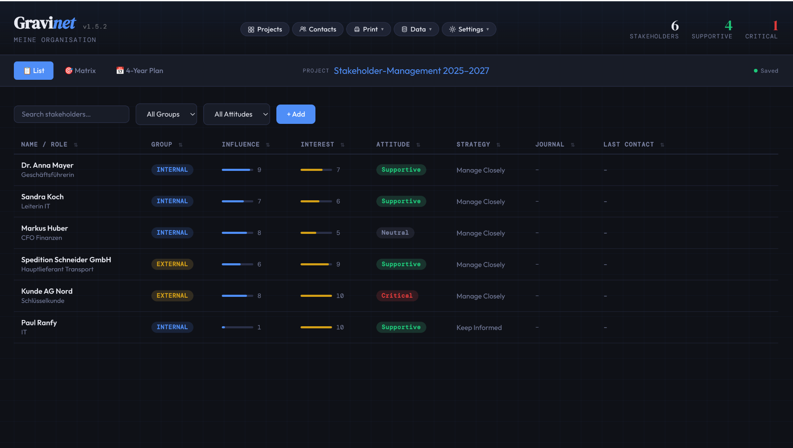
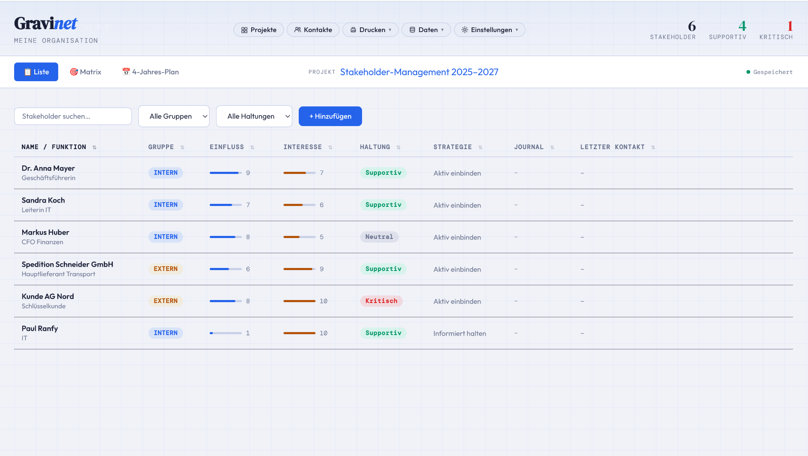
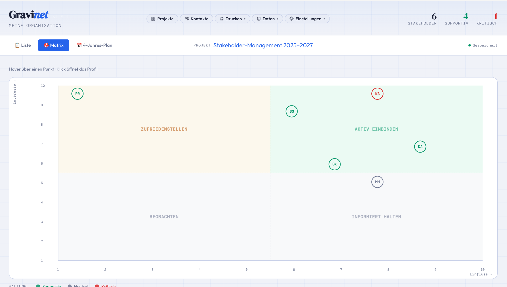
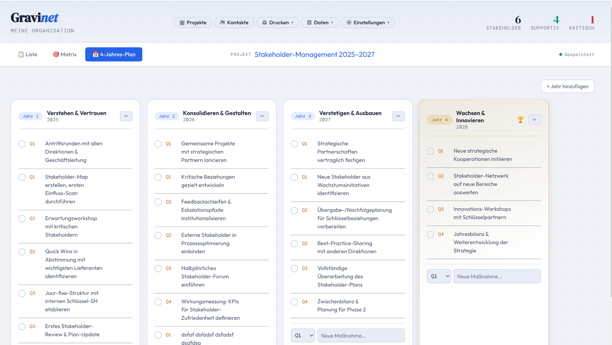
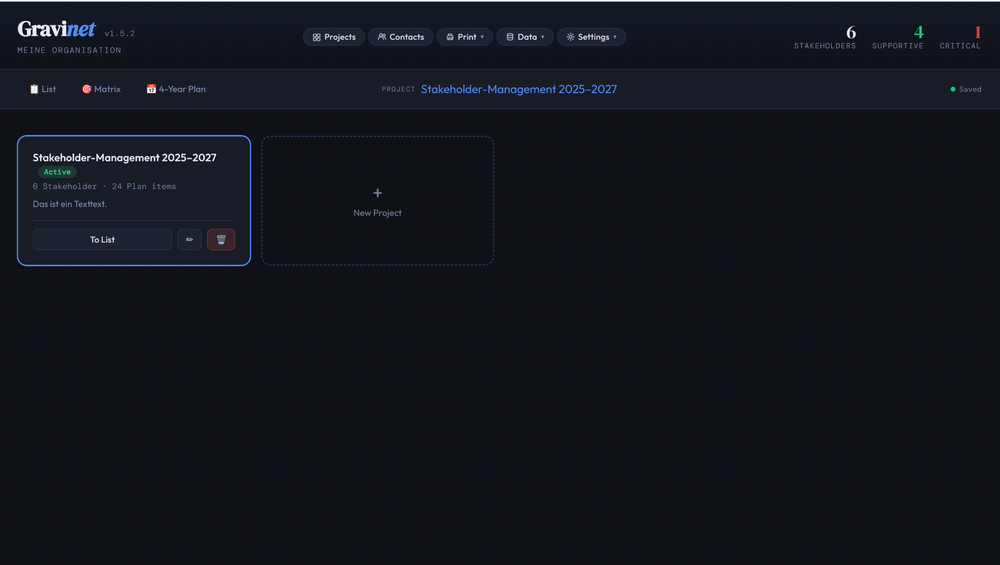
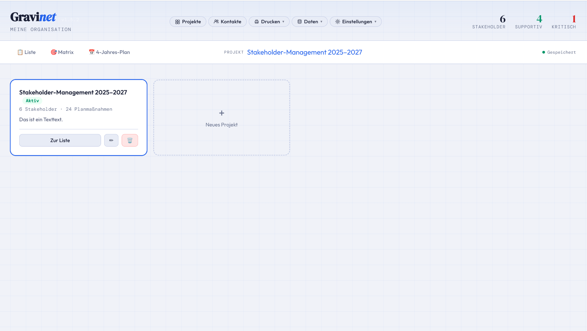
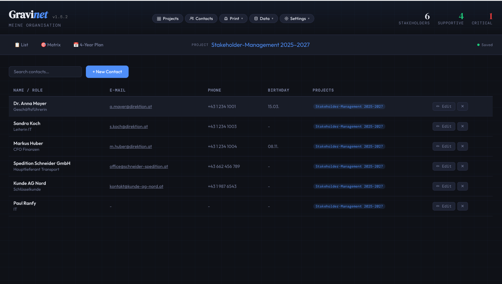
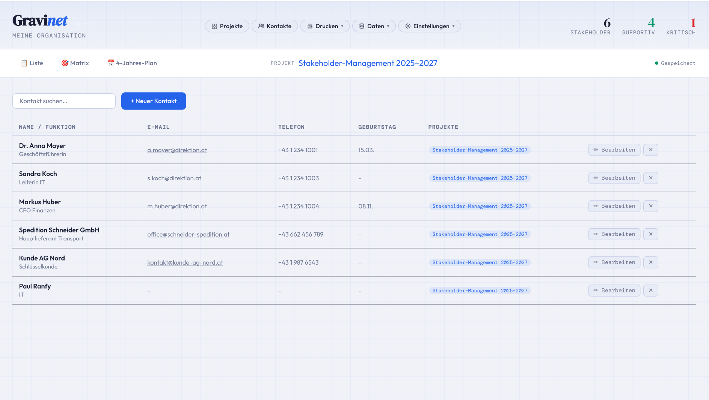

# Gravinet

**Stakeholder Management for Linux** — as an Electron AppImage, fully offline, no server or cloud required.

Gravinet helps you capture stakeholders, map them by influence and interest, document relationships through a journal, and maintain a multi-year action plan.

> 🇩🇪 Die App ist vollständig auf Deutsch und Englisch verfügbar — umschaltbar über Einstellungen → Sprache.
> 🇬🇧 The app is fully available in German and English — switchable via Settings → Language.

---

## Features

- **Projects** — multiple stakeholder projects, each with its own configuration, plan and description
- **Contacts** — central stakeholder database, shared across projects
- **List** — stakeholder table with search, filters, birthday reminders and last-contact display
- **Matrix** — interactive influence/interest matrix with quadrant overlay and tooltips
- **N-Year Plan** — flexible multi-year plan per project, measures per quarter, checkable
- **Journal** — personal contact notes per stakeholder with timestamp
- **PDF Export** — contact sheets and project report (table + matrix + plan) as PDF to Downloads
- **Data Backup** — export/import as JSON file
- **Light/Dark Theme** — saved and restored on next launch
- **Language** — German and English, persisted per workspace
- **Fully offline** — all data stored in local files, no account, no server

---

## Screenshots

| Dark | Light | 
| -----| ------| 
|  |  |
|------|--------|
|  |  |
|------|--------|
|  |  |
|------|--------|
|  |  |
|------|--------|
|  |  |


---

## Installation

### AppImage (recommended)

1. [Download the latest release](../../releases/latest) → `Gravinet-1.7.0.AppImage`
2. Make it executable and run it:

```bash
chmod +x Gravinet-1.7.0.AppImage
./Gravinet-1.7.0.AppImage
```

Optional: Integrate into GNOME as a desktop app (Nautilus → Properties → Allow executing as program).

---

## Build from Source

**Requirements:** Node.js ≥ 18, npm

```bash
git clone https://github.com/famrau/gravinet.git
cd gravinet
npm install
npm start          # Development mode
npm run build      # Build AppImage → dist/Gravinet-1.7.0.AppImage
```

### Windows (.exe / NSIS installer)

The Windows build must be performed on a **Windows machine** or in a Windows VM.

1. Clone the repository on a Windows machine
2. Install Node.js ≥ 18
3. Extend the `build` block in `package.json` with a Windows target:

```json
"win": {
  "target": [{ "target": "nsis", "arch": ["x64"] }],
  "icon": "app/icons/icon-512.png"
}
```

4. Run the build:

```bash
npm install
npx electron-builder --win
```

Result: `dist/Gravinet Setup 1.7.0.exe` (NSIS installer)

Alternatively, build a portable EXE without installer:

```json
"target": [{ "target": "portable", "arch": ["x64"] }]
```

---

### macOS (.dmg)

The macOS build must be performed on a **Mac**.

1. Clone the repository on a Mac
2. Install Node.js ≥ 18 (e.g. via [Homebrew](https://brew.sh): `brew install node`)
3. Extend the `build` block in `package.json` with a macOS target:

```json
"mac": {
  "target": [{ "target": "dmg", "arch": ["x64", "arm64"] }],
  "icon": "app/icons/icon-512.png",
  "category": "public.app-category.productivity"
}
```

4. Run the build:

```bash
npm install
npx electron-builder --mac
```

Result: `dist/Gravinet-1.7.0.dmg` (for Intel and Apple Silicon)

> **Note:** A signed and notarized macOS app requires a paid Apple Developer account. Without signing, a security warning appears on first launch, which can be bypassed via System Settings → Privacy & Security → "Open Anyway".

---

## Project Structure

```
gravinet/
├── main.js          # Electron main process (window, PDF printing, theme)
├── preload.js       # Context bridge: data storage, PDF, theme, version API
├── package.json     # Build configuration
└── app/
    ├── index.html   # App shell (HTML structure + modal overlays)
    ├── css/         # Stylesheets (vars, layout, components, matrix, plan, modals)
    ├── icons/       # App icons (SVG + PNG, 16–512 px)
    └── js/
        ├── i18n.js      # Translations (de/en) + t() + applyTranslations()
        ├── constants.js # Strategy map, colours, default plan
        ├── state.js     # Global mutable state
        ├── helpers.js   # Pure utility functions
        ├── theme.js     # Light/dark theme
        ├── storage.js   # File-based persistence (IPC)
        ├── ui.js        # Navigation, pill menus, save status
        ├── views.js     # Table, matrix, contacts, projects rendering
        ├── detail.js    # Detail panel + journal
        ├── modals.js    # All modal dialogs
        ├── plan.js      # N-year plan view
        ├── print.js     # PDF generation
        └── app.js       # Initialisation
```

---

## Data Storage

All data is stored as JSON files in the Electron user-data directory:

```
~/.config/Gravinet/
├── workspace.json      # Active project, settings (theme, language, interval)
├── contacts.json       # All stakeholders
└── projects/
    ├── proj1.json
    └── proj2.json
```

**Backup:** Data → Export saves a single JSON file. It can be restored on another machine via Data → Import.

---

## Keyboard Shortcuts

| Action | Shortcut |
|--------|----------|
| Save new plan measure | `Enter` in text field |
| Edit organisation name | Hover over subtitle → ✏ |
| Save organisation name | `Enter` or ✓ |
| Cancel organisation name | `Escape` |

---

## PDF Output

**Contact sheets** (Print → Contact Sheets):
- Select contacts; PDF is saved to `~/Downloads`
- One page per contact: master data, all project assignments, journal

**Project report** (Print → Project Report):
- Page 1: Stakeholder table
- Page 2: Stakeholder matrix
- Page 3: N-year plan
- Filename: `ProjectName-DATE.pdf`

---

## Tech Stack

| Technology | Usage |
|------------|-------|
| [Electron 28](https://www.electronjs.org/) | Desktop shell, PDF printing |
| [electron-builder](https://www.electron.build/) | AppImage packaging |
| Vanilla HTML/CSS/JS | Entire UI, no framework |
| [Outfit](https://fonts.google.com/specimen/Outfit) | UI font |
| [DM Serif Display](https://fonts.google.com/specimen/DM+Serif+Display) | Headings |
| [DM Mono](https://fonts.google.com/specimen/DM+Mono) | Monospace / labels |

---

## Changelog

### v1.8.1
- "Liste" tab renamed to "Stakeholder" (DE: Stakeholder, EN: Stakeholders)
- Dashboard column headers coloured by category (red, amber, blue, green); coloured top border removed
- Light theme surfaces changed to very light grey for dashboard cards and menus
- App starts on the Dashboard tab

### v1.8.0
- Inline editing in the stakeholder table: Group (dropdown), Influence/Interest (range slider), Attitude (coloured dropdown), Relationship strength (clickable stars)
- Journal column: clickable 📄 icon opens journal tab directly; ✎ button opens inline entry form for first journal entry
- Dashboard columns styled as cards; app starts on the Dashboard tab

### v1.7.0
- Stakeholder notes field — free-text area per stakeholder for permanent information (interests, red lines, personal details); shown in detail panel and printed in contact sheets
- Row background colour in the stakeholder table reflects attitude (red tint for critical, green for supportive)
- Version number in header now uses theme-aware colour (visible in both dark and light mode)
- Notes section background adapts to current theme

### v1.6.0
- **Activity Dashboard** — new tab with four columns: overdue contacts, contacts due soon, upcoming birthdays (30 days), recent journal activity across all projects
- **Per-stakeholder contact interval** — each stakeholder can have its own contact interval; falls back to global setting
- **Relationship strength (Beziehungsstärke)** — 1–5 rating stored per project assignment; shown as ★ stars in the detail panel, as a sortable column in the table, and as variable dot size/glow in the matrix

### v1.5.0
- Full German / English UI with live language switcher in Settings
- All translatable strings use `data-i18n` attributes and a central `TRANSLATIONS` object
- Strategy labels, badges, and PDF output are fully translated
- App version number displayed top-left next to the logo
- Data persistence fixed: `userData` path pinned to `~/.config/Gravinet/` so data survives AppImage updates
- Version retrieved via IPC (`app.getVersion()`) for reliable display in packaged builds
- README rewritten in English

### v1.4.0
- Language switcher introduced (DE/EN) in the Settings menu
- i18n architecture: `i18n.js` loaded first, `t(key)` function, `applyTranslations()` on every render

### v1.3.0
- Settings menu restructured into sub-sections (Theme, Contact Interval, Language)
- Contact interval warning: stakeholders whose last contact exceeds the configured interval are highlighted in the table and on the dashboard

### v1.2.0
- Sortable table columns (Name, Group, Influence, Interest, Attitude, Strategy, Journal, Last Contact)
- Sort direction indicator (▲/▼) in column headers

### v1.1.0
- Codebase split from a single HTML file into separate JS and CSS modules
- File-based storage via Electron IPC (one JSON file per project + `contacts.json` + `workspace.json`)
- Multiple projects with independent stakeholder assignments
